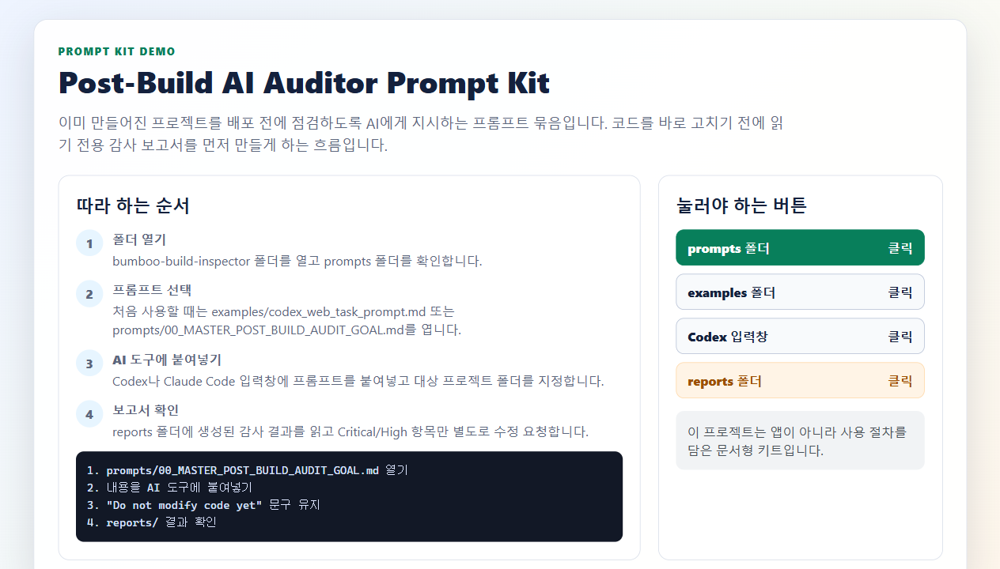

# Post-Build AI Auditor Prompt Kit

> A structured audit kit for reviewing software after the first AI-assisted build exists.

[Overview](README.md) | [English](docs/readme/README.en.md) | [한국어](docs/readme/README.ko.md) | [中文](docs/readme/README.zh-CN.md) | [日本語](docs/readme/README.ja.md)

| Area | Detail |
|---|---|
| Use case | Post-build release-readiness and risk audit |
| Works with | Codex, Claude Code, ChatGPT, and similar coding agents |
| Default mode | Read-only audit before any modification |
| Outputs | Project summaries, audit reports, remediation plans, and release decisions |

## Preview

The demo guide shows the non-developer flow: prepare evidence, choose the prompt, then review the returned audit issues.



<details>
<summary>View full demo walkthrough</summary>

This project is not a standalone app. It is a prompt and checklist kit for asking an AI coding agent to audit a project after the first build exists.

1. Prepare the target project's build logs, test results, and deployment target.
2. Open `CLAUDE.md` or a checklist from the `checklists` folder.
3. Give the checklist and project path to Codex, Claude, or another coding agent.
4. Turn the returned security, deployment, dependency, and release-readiness notes into an issue list.

The screenshot below is a non-developer demo guide. Prepare the materials in the order shown on the left, then open the prompt or checklist files shown on the right.


</details>

## Quick Start

```text
Read AGENTS.md first.
Then run a post-build audit using prompts/00_MASTER_POST_BUILD_AUDIT_GOAL.md.
Do not modify code yet.
Create the required reports under reports/.
```

## Documentation

- [English README](docs/readme/README.en.md)
- [한국어 README](docs/readme/README.ko.md)
- [中文 README](docs/readme/README.zh-CN.md)
- [日本語 README](docs/readme/README.ja.md)

## Notes

This overview is intentionally short. Detailed setup, architecture, limitations, and localized walkthroughs live in the linked README files.
